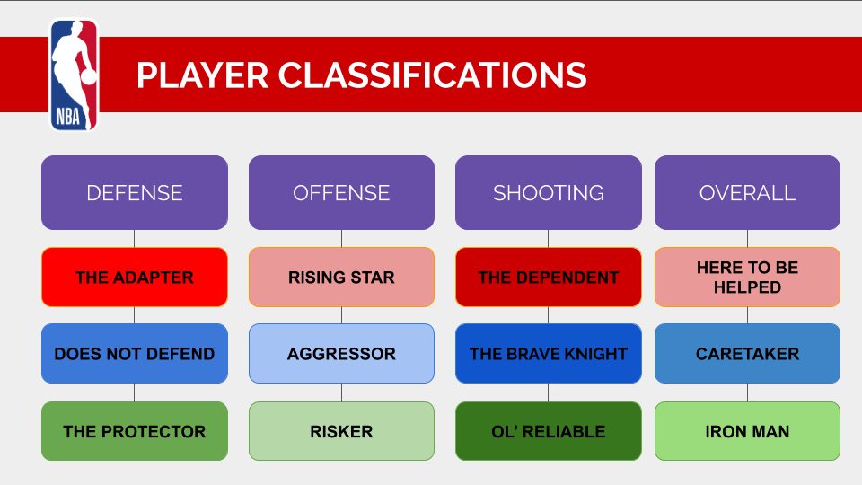
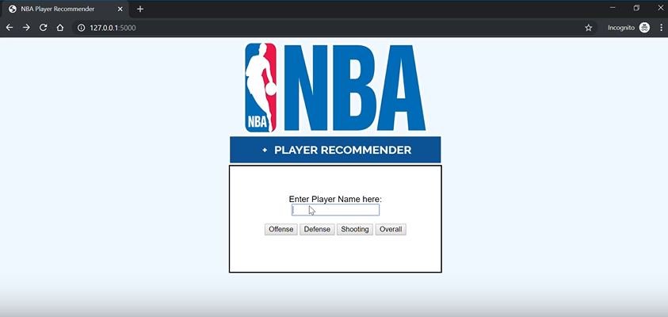

# Classify NBA Players w/Machine Learning
**Brianna Lytle | DSI-CC9-LA | FINAL CAPSTONE THESIS ALMOST DONE**

# Problem
Basketball players are given one of 5 labels that describe their role on the court. No matter the case, each position is expected to shoot and do their best to play a good offense and defense at one point on the court. 

Using unsupervised learning, my goal is to identify the type of players that are in the NBA. I will also create a recommendation system so that any person can find a similar player to the one they have in mind. 

# Data
## Scrapers
1. 01_Salary_scrapes - Scrapes salaries of players from team pages on [basketball-reference](https://www.basketball-reference.com/). This file is scraping from the Uses the BeautifulSoup and Selenium.
2. 02_538scrape - Scrapes from [FIVETHIRTYEIGHT](https://projects.fivethirtyeight.com/2020-nba-player-ratings/) Player Ratings using BeautifulSoup. 538 has their own rankings for players. The scraped RAPTOR scores are for the current 2019-2020 NBA season. 
3. 03_stats_nba_scrape - Scrapes different tables from [stats.nba.com](https://stats.nba.com/) using Selenium. I scraped for Traditional, Defense, Scoring, Usage, and Misc player statistics. 
4. 04_bball-ref-scrape - Scraping from [basketball-reference Advanced Stats](https://www.basketball-reference.com/leagues/NBA_2020_per_poss.html) using BeautifulSoup. This file was intended to scrape different seasons of advanced statistics per 100 team possessions. This scraped data was not used in the modeling process due to troubles in the data cleaning process.

## Data Cleaning
Issues with data included
    1. Mismatching names (ex/"Glen Robinson" vs "Glenn Robinson III", "Taurean Waller-Prince" vs "Taurean Prince")
    2. Players on roster with missing Data (ex/ Kevin Durant out of season due to injury)
    3. Players who were waived before season started but still exist on a basketball-reference.com roster (ex/ J.R. Smith)

## Final Data Set
The final data set includes player salaries, RAPTOR ratings, and stats scraped from stats.nba.com. The last scrape update was on December 4, 2019 were each team had about 17-20 games already played. 

# EDA
## Unsupervised Learning
My focus was on four subjects: Defense, Offense, Shooting, and Overall. With Principal Component Analysis (PCA) and Kmeans clustering, I identified three different types of players within these four categories. These categories or described more in their respective notebookes in the kmeans_investigation folder.

# Recommendation System
The goal of the recommendation system is allow a user find other NBA players who play similarily to their player of choice. A recommendation system was created for Defense, Offense, Shooting, and Overall metrics. The recommendation system is displayed in the flask app as well. 

## Flask App
A user would enter their player of choice, and select a button as to what "Type" of similar player they want. For example, if the user selected "Defense", then the App would return the top 3 players which are similar to the player of choice based on their defense playing style. The result will also display each player's salary so that the user can understand the worth of each player. This would allow coaches or team managers understand which group of people have similar playing styles and their overall worth to the NBA.

Here is a rough draft of the flask app:

# Next Steps
- Scrape for more data
- Create a more concrete data cleaning system to solve most data cleaning problems. 
- Create a system to make up for missing player statistics so the model can include more season data
- Edit Flask app so it isn't sensitive to spelling. 
- More EDA investigation to add to description's of each type of player and display this in the Flask App.
- Incorporate Social Media Data
- Include more features in flask (social media updates, photos, external news links)

**Sources:** 
- https://stats.nba.com/
- https://www.basketball-reference.com/
- https://projects.fivethirtyeight.com/2020-nba-player-ratings/
- https://medium.com/datadriveninvestor/using-machine-learning-to-cluster-nba-skillsets-db90a87c2544
